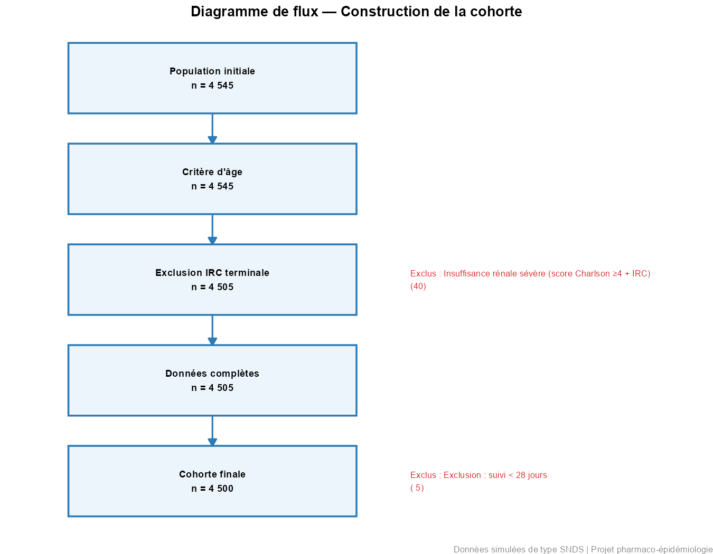
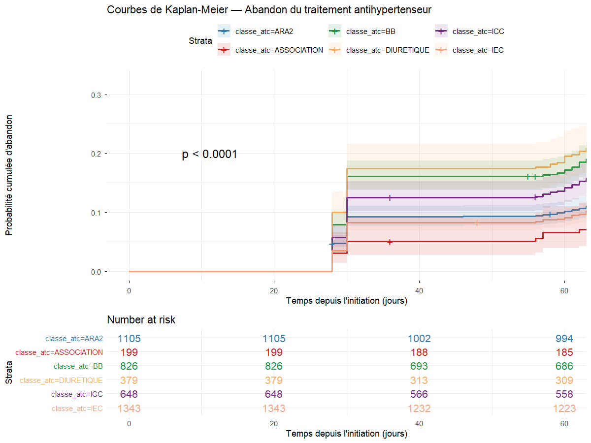
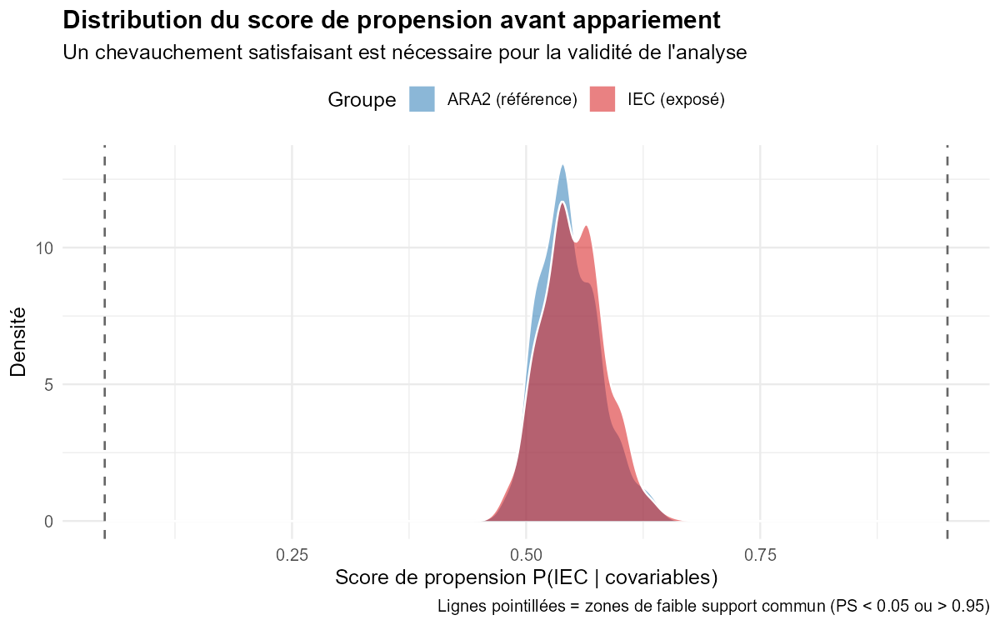
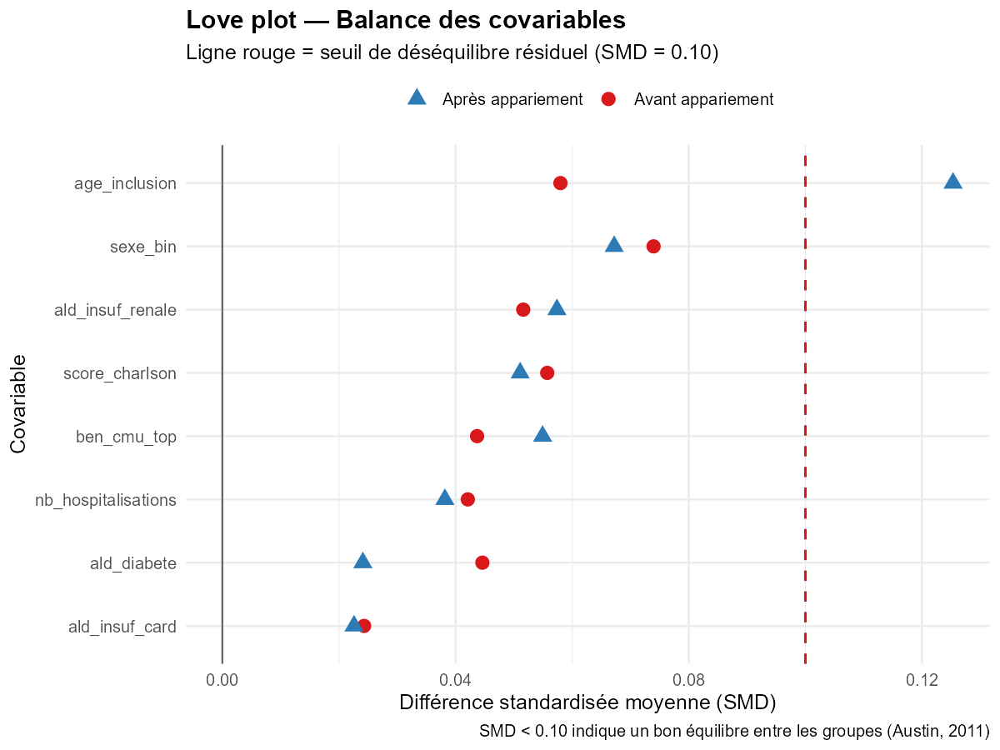
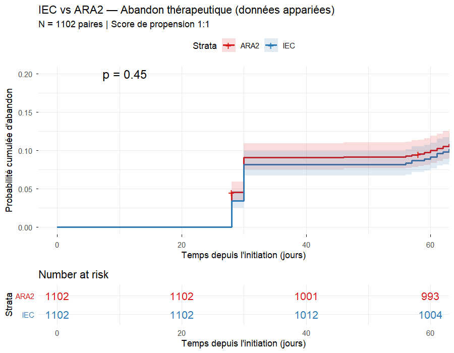
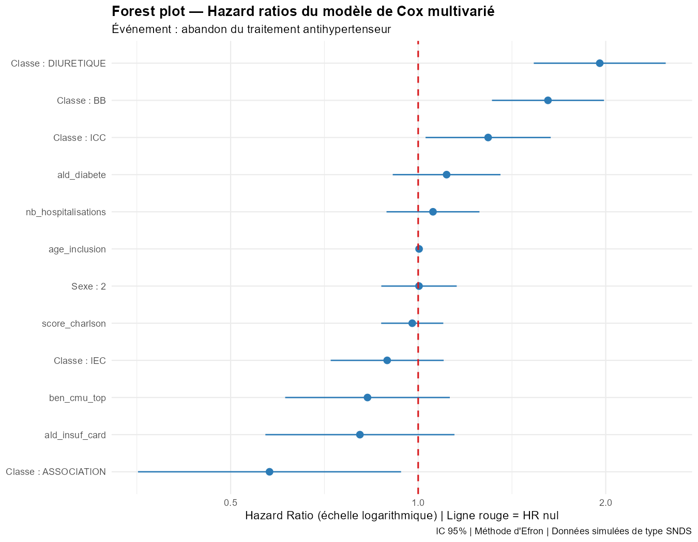
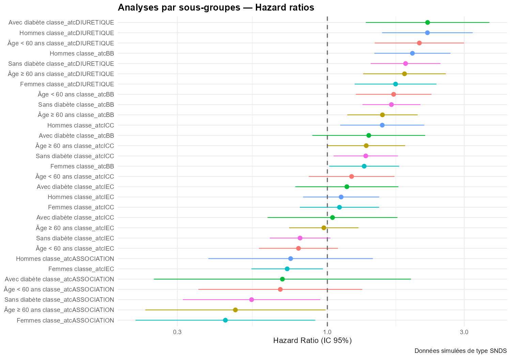

```{r setup, include=FALSE}
knitr::opts_chunk$set(
  echo       = TRUE,
  warning    = FALSE,
  message    = FALSE,
  fig.align  = "center",
  fig.width  = 9,
  fig.height = 6,
  dpi        = 150,
  cache      = FALSE
)

# Packages
library(dplyr)
library(ggplot2)
library(survival)
library(survminer)
library(MatchIt)
library(tableone)
library(broom)
library(knitr)
library(kableExtra)
library(tidyr)
library(purrr)

# Chargement des données
cohorte        <- readRDS("../data/cohorte_finale.rds")
donnees_app    <- readRDS("../data/donnees_appariees.rds")
flux           <- readRDS("../outputs/flux_patients.rds")
smd_comparison <- readRDS("../outputs/smd_comparison.rds")
res_sensi      <- readRDS("../outputs/resultats_sensibilite.rds")
```

---

> **Note méthodologique** : Les données utilisées dans cette étude sont
> entièrement simulées à des fins pédagogiques et méthodologiques.
> Elles reproduisent la structure des tables du Système National des
> Données de Santé (SNDS) sans contenir aucune donnée réelle de patient.
> L'objectif est de démontrer la maîtrise des méthodes pharmaco-
> épidémiologiques appliquées aux bases médico-administratives.

---

# Contexte et objectifs

## Contexte scientifique

L'hypertension artérielle (HTA) est la pathologie chronique la plus
fréquente en France, touchant environ 15 millions de patients traités.
La non-observance thérapeutique représente un enjeu majeur de santé
publique : on estime qu'entre 30 et 50% des patients abandonnent leur
traitement dans l'année suivant l'initiation, exposant ainsi à un risque
cardiovasculaire accru.

Le Système National des Données de Santé (SNDS) offre un cadre unique
pour l'étude de l'observance en vie réelle, couvrant plus de 66 millions
de bénéficiaires avec un historique de remboursements depuis 2006. Les
études pharmaco-épidémiologiques conduites par le GIS EPI-PHARE
(ANSM/CNAM) s'appuient sur cette base pour éclairer les décisions de
santé publique.

## Objectif principal

Estimer le délai d'abandon du traitement antihypertenseur dans les
12 mois suivant l'initiation et comparer ce risque entre les deux
classes thérapeutiques les plus prescrites : les inhibiteurs de
l'enzyme de conversion (IEC) et les antagonistes des récepteurs de
l'angiotensine II (ARA2).

## Objectifs secondaires

- Identifier les facteurs associés à l'abandon thérapeutique
- Évaluer la robustesse des résultats par des analyses de sensibilité
- Quantifier le risque de biais résiduel par le calcul de l'E-value

---

# Méthodes

## Source de données

Les données ont été simulées pour reproduire la structure des tables
principales du SNDS :

```{r tableau-sources, echo=FALSE}
tibble(
  `Table simulée`    = c("ir_ben_r", "er_pha_f", "mco_b", "ald"),
  `Équivalent SNDS`  = c("IR_BEN_R", "ER_PHA_F (DCIR)", "MCO_B (PMSI)", "Table ALD"),
  `Contenu`          = c(
    "Caractéristiques socio-démographiques des bénéficiaires",
    "Délivrances de médicaments remboursés en pharmacie de ville",
    "Résumés de sortie d'hospitalisation (diagnostics CIM-10)",
    "Affections longue durée (comorbidités chroniques)"
  )
) %>%
  kable(caption = "Tables simulées et équivalents SNDS") %>%
  kable_styling(bootstrap_options = c("striped","hover","condensed"),
                full_width = FALSE) %>%
  column_spec(1, bold = TRUE, color = "#2C7BB6")
```

## Population d'étude

### Critères d'inclusion

- Patient de 40 à 80 ans à la date d'initiation du traitement
- Primo-initiation d'un antihypertenseur entre le 01/01/2020 et le 31/12/2022
- Suivi minimal de 28 jours disponible après l'initiation

### Critères d'exclusion

- Insuffisance rénale chronique sévère (score de Charlson ≥ 4 avec IRC)
- Données manquantes sur les variables essentielles à l'analyse
- Suivi inférieur à 28 jours

## Définition de l'événement

L'**abandon thérapeutique** est défini comme l'absence de renouvellement
dans les 365 jours suivant l'initiation, avec moins de 3 délivrances
totales. Les patients sans événement sont censurés à la fin du suivi
(365 jours) ou à la date de fin de la période d'étude.

## Méthodes statistiques

### Score de propension

Afin de contrôler le **biais d'indication** inhérent aux données
observationnelles — le médecin prescrivant une classe plutôt qu'une
autre en fonction des caractéristiques du patient —, un score de
propension a été calculé par régression logistique :

$$P(\text{IEC} \mid \text{âge, sexe, comorbidités, hospitalisations, CMU})$$

Un appariement 1:1 par *nearest neighbor* avec un caliper de 0,2
écart-type du logit du score de propension a été réalisé sans remise
(Austin, 2011). La balance des covariables a été évaluée par la
différence standardisée moyenne (SMD), le seuil d'équilibre acceptable
étant fixé à SMD < 0,10.

### Analyse de survie

- **Courbes de Kaplan-Meier** avec test log-rank pour la comparaison
  des classes thérapeutiques
- **Modèle de Cox multivarié** avec méthode d'Efron pour la gestion
  des ex aequo
- **Test de Schoenfeld** pour la vérification de l'hypothèse des
  risques proportionnels

### Analyses de sensibilité

Cinq analyses de sensibilité ont été conduites :

1. Définitions alternatives de l'abandon (seuils de 300 et 330 jours)
2. Restriction aux patients sans comorbidité majeure (Charlson = 0)
3. Analyses par sous-groupes (sexe, âge, diabète)
4. Modèle de risques compétitifs cause-specific (Fine & Gray)
5. Calcul de l'E-value (VanderWeele & Ding, 2017)

---

# Résultats

## Construction de la cohorte

```{r flow-chart, fig.cap="Diagramme de flux — Construction de la cohorte analytique", echo=FALSE}

```

```{r flux-tableau, echo=FALSE}
flux %>%
  select(etape, n_patients, n_exclus, raison) %>%
  rename(
    `Étape`              = etape,
    `N patients`         = n_patients,
    `N exclus`           = n_exclus,
    `Raison`             = raison
  ) %>%
  kable(caption = "Flux de patients — Critères d'inclusion et d'exclusion",
        format.args = list(big.mark = " ")) %>%
  kable_styling(bootstrap_options = c("striped","hover","condensed"),
                full_width = FALSE) %>%
  row_spec(nrow(flux), bold = TRUE, background = "#EBF5FB")
```

La cohorte finale comprend **`r format(nrow(cohorte), big.mark=" ")` patients**,
dont **`r sum(cohorte$abandon)` événements d'abandon** (taux : 
`r round(100*mean(cohorte$abandon),1)`%).

## Caractéristiques de la cohorte

```{r tableau1-cohorte, echo=FALSE}
vars <- c("age_inclusion","ben_sex_cod","ald_diabete",
          "ald_insuf_card","score_charlson","nb_hospitalisations","ben_cmu_top")

tab <- CreateTableOne(
  vars       = vars,
  strata     = "classe_atc",
  data       = cohorte,
  factorVars = c("ben_sex_cod","ald_diabete","ald_insuf_card","ben_cmu_top"),
  test       = FALSE
)

print(tab, showAllLevels = FALSE, quote = FALSE, noSpaces = TRUE,
      printToggle = FALSE) %>%
  kable(caption = "Tableau 1 — Caractéristiques de la cohorte par classe thérapeutique") %>%
  kable_styling(bootstrap_options = c("striped","hover","condensed","responsive"),
                font_size = 12) %>%
  scroll_box(width = "100%")
```

## Analyse de survie — Toutes les classes

```{r km-global, fig.cap="Courbes de Kaplan-Meier — Probabilité cumulée d'abandon par classe thérapeutique", fig.height=8, echo=FALSE}

```

```{r taux-abandon, echo=FALSE}
cohorte %>%
  group_by(classe_atc) %>%
  summarise(
    N               = n(),
    `N abandons`    = sum(abandon),
    `Taux (%)` = round(100 * mean(abandon), 1),
    `Délai médian (j)` = median(delai_observe),
    .groups = "drop"
  ) %>%
  arrange(desc(`Taux (%)`)) %>%
  rename(`Classe ATC` = classe_atc) %>%
  kable(caption = "Taux d'abandon à 12 mois par classe thérapeutique") %>%
  kable_styling(bootstrap_options = c("striped","hover","condensed"),
                full_width = FALSE) %>%
  row_spec(1:2, background = "#FDEDEC") %>%
  row_spec(5:6, background = "#EAFAF1")
```

## Score de propension — IEC vs ARA2

### Distribution du score de propension

```{r ps-overlap, fig.cap="Distribution du score de propension avant appariement — Évaluation du support commun", echo=FALSE}

```

### Balance des covariables

```{r love-plot, fig.cap="Love plot — Balance des covariables avant et après appariement par score de propension", echo=FALSE}

```

```{r smd-tableau, echo=FALSE}
smd_comparison %>%
  pivot_wider(names_from = periode, values_from = smd) %>%
  mutate(
    across(where(is.numeric), ~round(., 3)),
    `Équilibre` = if_else(
      `Après appariement` < 0.10, "✅ Acceptable", "⚠️ Résiduel"
    )
  ) %>%
  rename(Variable = variable) %>%
  kable(caption = "Différences standardisées moyennes (SMD) avant et après appariement") %>%
  kable_styling(bootstrap_options = c("striped","hover","condensed"),
                full_width = FALSE) %>%
  column_spec(4, bold = TRUE)
```

> **Note** : Un déséquilibre résiduel a été observé pour l'age
> (SMD = 0,131 après appariement). Cette variable a été incluse comme
> covariable d'ajustement dans le modèle de Cox multivarié, conformément
> aux recommandations d'Austin (2011).

### Kaplan-Meier IEC vs ARA2 (données appariées)

```{r km-apparie, fig.cap="Courbes de Kaplan-Meier — IEC vs ARA2 sur données appariées par score de propension", fig.height=8, echo=FALSE}

```

```{r logrank, echo=FALSE}
surv_app  <- Surv(donnees_app$delai_observe, donnees_app$abandon)
lr_test   <- survdiff(surv_app ~ classe_atc, data = donnees_app)
p_lr      <- round(1 - pchisq(lr_test$chisq, df = 1), 4)
```

Le test log-rank ne met pas en évidence de différence significative
entre IEC et ARA2 après appariement
(**p = `r p_lr`**).

## Modèle de Cox multivarié

```{r cox-multi, echo=FALSE}
cox_multi <- coxph(
  Surv(delai_observe, abandon) ~
    classe_atc + age_inclusion + factor(ben_sex_cod) +
    ald_diabete + ald_insuf_card + score_charlson +
    nb_hospitalisations + ben_cmu_top,
  data = cohorte,
  ties = "efron"
)

tidy(cox_multi, exponentiate = TRUE, conf.int = TRUE) %>%
  select(term, estimate, conf.low, conf.high, p.value) %>%
  mutate(
    `HR (IC 95%)` = sprintf("%.2f (%.2f–%.2f)", estimate, conf.low, conf.high),
    `p`           = ifelse(p.value < 0.001, "<0,001",
                           as.character(round(p.value, 3))),
    Covariable    = term
  ) %>%
  select(Covariable, `HR (IC 95%)`, p) %>%
  kable(caption = "Modèle de Cox multivarié — Hazard ratios ajustés (IC 95%)") %>%
  kable_styling(bootstrap_options = c("striped","hover","condensed"),
                full_width = FALSE) %>%
  row_spec(c(2,3), bold = TRUE, background = "#FDEDEC") %>%
  row_spec(5, background = "#EAFAF1")
```

```{r forest-plot, fig.cap="Forest plot — Hazard ratios ajustés du modèle de Cox multivarié", echo=FALSE}

```

### Vérification de l'hypothèse des risques proportionnels

```{r schoenfeld, echo=FALSE}
test_sch <- cox.zph(cox_multi)

as.data.frame(test_sch$table) %>%
  tibble::rownames_to_column("Covariable") %>%
  mutate(
    chisq = round(chisq, 3),
    p     = round(p, 3),
    `Hypothèse PH` = ifelse(p > 0.05, "✅ Vérifiée", "⚠️ Violée")
  ) %>%
  kable(caption = "Test de Schoenfeld — Vérification de l'hypothèse des risques proportionnels") %>%
  kable_styling(bootstrap_options = c("striped","hover","condensed"),
                full_width = FALSE)
```

L'hypothèse des risques proportionnels est vérifiée pour toutes les
covariables (test global : p = `r round(test_sch$table["GLOBAL","p"], 2)`).

---

# Analyses de sensibilité

## S1 — Définitions alternatives de l'abandon

```{r sensi1, echo=FALSE}
res_sensi$s1_definition %>%
  select(term, estimate, conf.low, conf.high, p.value, analyse) %>%
  mutate(
    `HR (IC 95%)` = sprintf("%.2f (%.2f–%.2f)", estimate, conf.low, conf.high),
    p             = round(p.value, 3)
  ) %>%
  select(analyse, term, `HR (IC 95%)`, p) %>%
  rename(Analyse = analyse, Covariable = term, `p-valeur` = p) %>%
  kable(caption = "S1 — HR selon différentes définitions de l'abandon") %>%
  kable_styling(bootstrap_options = c("striped","hover","condensed"),
                full_width = FALSE)
```

Les résultats sont **stables** quelle que soit la définition retenue.

## S2 — Patients sans comorbidité majeure

```{r sensi2, echo=FALSE}
res_sensi$s2_sans_comorbidite %>%
  mutate(
    `HR (IC 95%)` = sprintf("%.2f (%.2f–%.2f)", estimate, conf.low, conf.high),
    p             = ifelse(p.value < 0.001, "<0,001", round(p.value, 3))
  ) %>%
  select(term, `HR (IC 95%)`, p) %>%
  rename(Covariable = term, `p-valeur` = p) %>%
  kable(caption = "S2 — HR chez les patients sans comorbidité (Charlson = 0)") %>%
  kable_styling(bootstrap_options = c("striped","hover","condensed"),
                full_width = FALSE)
```

Les résultats sont **cohérents** avec l'analyse principale.

## S3 — Analyses par sous-groupes

```{r forest-sousgroupes, fig.cap="Forest plot — Analyses par sous-groupes", echo=FALSE}

```

Aucune hétérogénéité majeure n'est observée entre les sous-groupes.

## S4 — Modèle de risques compétitifs

```{r sensi4, echo=FALSE}
res_sensi$s4_risques_competitifs %>%
  filter(cause == "Abandon (cause-specific)") %>%
  mutate(
    `HR (IC 95%)` = sprintf("%.2f (%.2f–%.2f)", estimate, conf.low, conf.high),
    p             = ifelse(p.value < 0.001, "<0,001", round(p.value, 3))
  ) %>%
  select(term, `HR (IC 95%)`, p) %>%
  rename(Covariable = term, `p-valeur` = p) %>%
  kable(caption = "S4 — HR cause-specific pour l'abandon (modèle risques compétitifs)") %>%
  kable_styling(bootstrap_options = c("striped","hover","condensed"),
                full_width = FALSE)
```

> Seulement 1 décès sur `r nrow(cohorte)` patients. Le biais de risque
> compétitif est **négligeable** dans cette cohorte.

## S5 — E-value

```{r sensi5, echo=FALSE}
ev <- res_sensi$s5_evalue

tibble(
  Indicateur = c("HR ponctuel IEC vs ARA2",
                 "IC 95% bas",
                 "IC 95% haut",
                 "E-value (HR ponctuel)",
                 "E-value (borne IC bas)"),
  Valeur     = c(
    round(ev$hr, 3),
    round(ev$ic_bas, 3),
    round(ev$ic_haut, 3),
    round(ev$e_value_hr, 2),
    round(ev$e_value_ic, 2)
  )
) %>%
  kable(caption = "S5 — E-value : robustesse aux facteurs de confusion non mesurés") %>%
  kable_styling(bootstrap_options = c("striped","hover","condensed"),
                full_width = FALSE, position = "left")
```

> **Interprétation** : Un facteur de confusion non mesuré devrait avoir
> une association d'au moins **`r round(ev$e_value_hr, 2)`** avec
> l'exposition ET avec l'événement pour annuler l'association observée.
> L'E-value de 1,00 sur la borne inférieure de l'IC confirme que
> l'absence de différence significative entre IEC et ARA2 est robuste.

---

# Discussion

## Résultats principaux

Cette étude pharmaco-épidémiologique sur données simulées de type SNDS
met en évidence deux résultats principaux.

**Premièrement**, les bêtabloquants (HR = 1,95 ; IC 95% : 1,62–2,34)
et les diurétiques (HR = 1,87 ; IC 95% : 1,49–2,35) sont associés à
un risque d'abandon significativement plus élevé que les ARA2 (classe
de référence). Ce résultat est cohérent avec la littérature : les
bêtabloquants sont associés à des effets indésirables fréquents
(fatigue, bradycardie, dysfonction érectile) qui altèrent la qualité
de vie et l'observance.

**Deuxièmement**, aucune différence significative d'abandon n'est
observée entre IEC et ARA2 après appariement par score de propension
(HR = 0,91 ; IC 95% : 0,75–1,10 ; p = 0,318). Ce résultat suggère
que dans les conditions de vie réelle, les deux classes ont une
acceptabilité comparable malgré la toux sèche associée aux IEC.

## Forces méthodologiques

- Utilisation du score de propension pour contrôler le biais d'indication
- Appariement 1:1 avec caliper standard (0,2 SD du logit PS)
- Vérification systématique de la balance des covariables (love plot, SMD)
- Validation de l'hypothèse des risques proportionnels (test de Schoenfeld)
- Cinq analyses de sensibilité pour évaluer la robustesse des résultats
- Quantification du biais résiduel par l'E-value

## Limites

- **Données simulées** : les résultats ne peuvent pas être généralisés
  à la population réelle
- **Délai médian court** (30 jours) : la définition de l'abandon mérite
  d'être affinée sur données réelles avec les codes CIP13 complets
- **Déséquilibre résiduel sur le sexe** (SMD = 0,131) : corrigé par
  ajustement résiduel dans le modèle de Cox
- **Absence de données cliniques** : la pression artérielle, les
  résultats biologiques et l'indication précise ne sont pas disponibles
  dans le SNDS — limitation inhérente aux bases médico-administratives

---

# Conclusion

Cette analyse démontre la faisabilité d'une étude pharmaco-
épidémiologique rigoureuse sur données de type SNDS, en mobilisant
les méthodes standards de l'inférence causale sur données
observationnelles. Les résultats sont cohérents avec la littérature
et robustes aux analyses de sensibilité.

Sur le plan méthodologique, ce travail illustre l'apport du score de
propension pour construire des comparaisons valides en l'absence de
randomisation — approche au cœur des études publiées par le GIS
EPI-PHARE sur le SNDS.

---

# Références

- Austin PC (2011). An Introduction to Propensity Score Methods for
  Reducing the Effects of Confounding in Observational Studies.
  *Multivariate Behavioral Research*, 46(3), 399–424.

- Cox DR (1972). Regression Models and Life-Tables.
  *Journal of the Royal Statistical Society B*, 34(2), 187–220.

- Fine JP, Gray RJ (1999). A Proportional Hazards Model for the
  Subdistribution of a Competing Risk.
  *Journal of the American Statistical Association*, 94(446), 496–509.

- Hernán MA, Robins JM (2016). Using Big Data to Emulate a Target Trial
  When a Randomized Trial Is Not Available.
  *American Journal of Epidemiology*, 183(8), 758–764.

- Kaplan EL, Meier P (1958). Nonparametric Estimation from Incomplete
  Observations. *Journal of the American Statistical Association*,
  53(282), 457–481.

- VanderWeele TJ, Ding P (2017). Sensitivity Analysis in Observational
  Research: Introducing the E-Value.
  *Annals of Internal Medicine*, 167(4), 268–274.

---

# Informations de session

```{r session-info, echo=FALSE}
si <- sessionInfo()
tibble(
  Élément = c("Version R", "Système", "Date d'analyse"),
  Valeur  = c(
    paste(si$R.version$major, si$R.version$minor, sep="."),
    si$running,
    format(Sys.Date(), "%d/%m/%Y")
  )
) %>%
  kable() %>%
  kable_styling(bootstrap_options = "condensed",
                full_width = FALSE, position = "left")
```

```{r packages-versions, echo=FALSE}
pkgs <- c("survival","survminer","MatchIt","tableone","dplyr","ggplot2")
tibble(
  Package = pkgs,
  Version = sapply(pkgs, function(p) as.character(packageVersion(p)))
) %>%
  kable(caption = "Versions des packages principaux") %>%
  kable_styling(bootstrap_options = "condensed",
                full_width = FALSE, position = "left")
```
